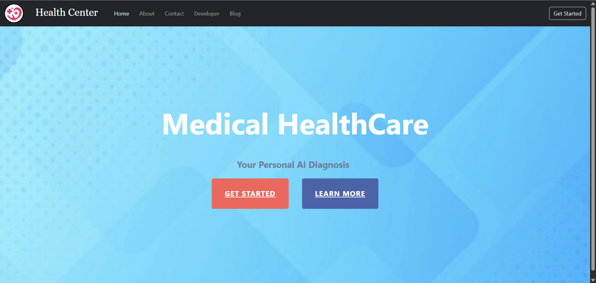
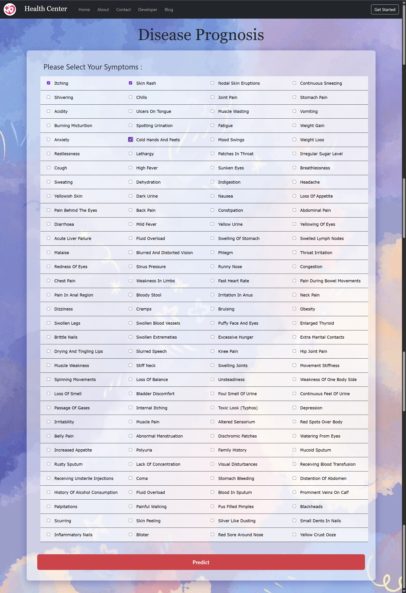
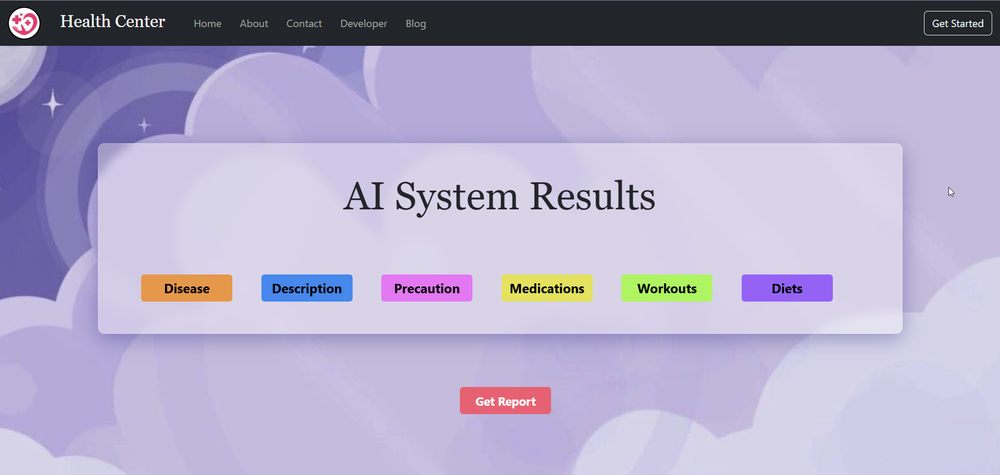
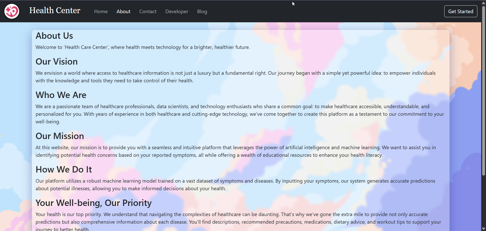
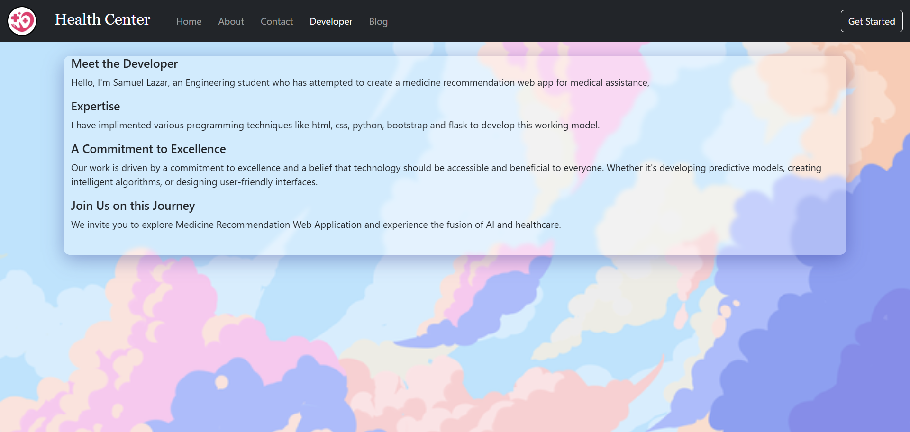

  # Medical Recommendation System

A Flask-based web application that provides medical recommendations including disease prediction, medications, diet suggestions, and workout plans based on user symptoms.

## Features

### 🔍 Disease Prediction
- Uses machine learning (SVC model) to predict diseases based on symptoms
- Interactive symptom selection interface
- Accurate predictions based on trained medical data

### 💊 Medical Recommendations
- **Disease Descriptions**: Detailed information about predicted conditions
- **Precautions**: Safety measures and preventive care guidelines
- **Medication Suggestions**: Recommended medicines for treatment
- **Diet Plans**: Nutritional recommendations for better health
- **Workout Plans**: Exercise suggestions tailored to specific conditions

### 🌐 User-Friendly Interface
- Clean and intuitive web design
- Responsive layout that works on all devices
- Easy navigation between different sections
- Professional medical-themed styling

## Technology Stack

- **Backend**: Python, Flask
- **Machine Learning**: Scikit-learn (Support Vector Classifier)
- **Data Processing**: Pandas, NumPy
- **Frontend**: HTML, CSS, JavaScript, jQuery, Bootstrap
- **Model Storage**: Pickle

## Installation

1. Clone the repository:
```bash
git clone https://github.com/SammyBoy-09/Medical_Recommendation_System.git
cd Medical_Recommendation_System
```

2. Create a virtual environment:
```bash
python -m venv venv
source venv/bin/activate  # On Windows: venv\Scripts\activate
```

3. Install dependencies:
```bash
pip install -r requirements.txt
```

## Screenshots

### Home Page

*The main landing page where users can navigate to different sections of the application.*

### Symptom Prediction Page

*Interactive symptom selection interface where users can input their symptoms.*

### Results Page

*Comprehensive medical recommendations including disease prediction, medications, diet, and workout plans.*

### About Page

*Information about the application and its purpose.*

### Developer Page

*Details about the development team and project contributors.*

## Usage

1. Run the Flask application:
```bash
python main.py
```

2. Open your web browser and navigate to `http://localhost:5000`

3. Select your symptoms from the available options

4. Get comprehensive medical recommendations

## Live Demo

🌐 **GitHub Repository**: [Medical Recommendation System](https://github.com/SammyBoy-09/Medical_Recommendation_System)

### How to Use:
1. **Select Symptoms**: Choose from a comprehensive list of medical symptoms
2. **Get Prediction**: The ML model analyzes your symptoms and predicts possible conditions
3. **View Recommendations**: Receive detailed medical recommendations including:
   - Disease information and descriptions
   - Precautionary measures to take
   - Suggested medications
   - Recommended diet plans
   - Beneficial workout routines

## Project Structure

```
├── main.py                 # Main Flask application
├── requirements.txt        # Python dependencies
├── datasets/              # CSV files with medical data
│   ├── description.csv
│   ├── diets.csv
│   ├── medications.csv
│   ├── precautions_df.csv
│   ├── Symptom-severity.csv
│   ├── symtoms_df.csv
│   ├── Training.csv
│   └── workout_df.csv
├── models/                # Trained ML models
│   └── svc.pkl
├── static/                # Static files (CSS, JS, images)
├── templates/             # HTML templates
└── .gitignore
```

## Dataset Information

The application uses several medical datasets:
- **Symptoms Data**: Comprehensive list of medical symptoms
- **Disease Descriptions**: Detailed information about various diseases
- **Medications**: Medicine recommendations for different conditions
- **Diet Plans**: Nutritional recommendations
- **Workout Plans**: Exercise suggestions for different health conditions
- **Precautions**: Safety measures and preventive care

## Model Information

The application uses a Support Vector Classifier (SVC) model trained on medical symptom data to predict diseases. The model is pre-trained and stored as a pickle file.

## Important Note

⚠️ **Disclaimer**: This application is for educational and informational purposes only. It should not be used as a substitute for professional medical advice, diagnosis, or treatment. Always consult with qualified healthcare professionals for medical concerns.

## Contributing

1. Fork the repository
2. Create a feature branch
3. Make your changes
4. Submit a pull request

## License

This project is licensed under the MIT License - see the LICENSE file for details.
